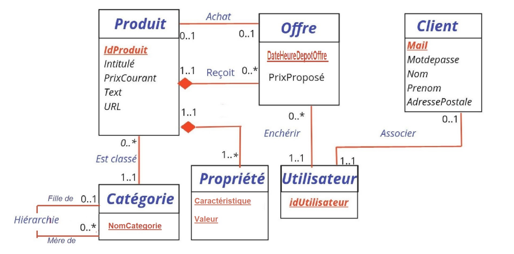
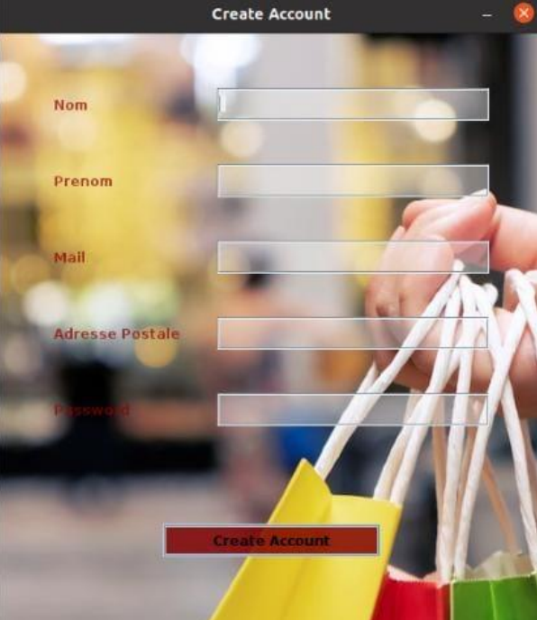
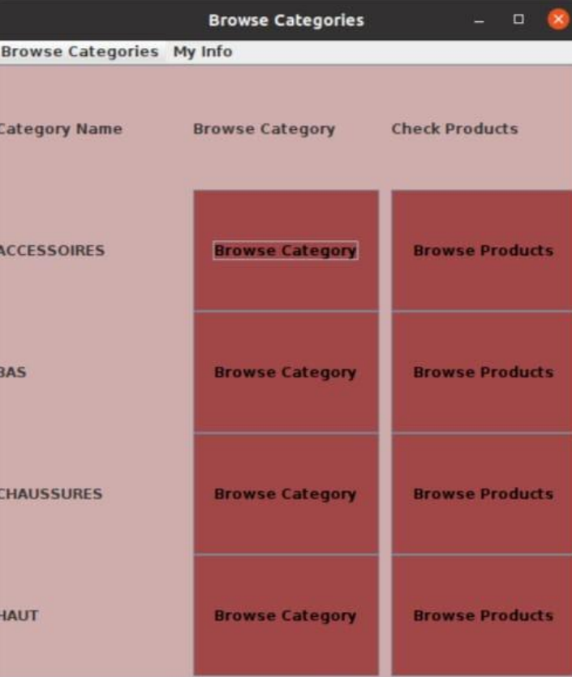
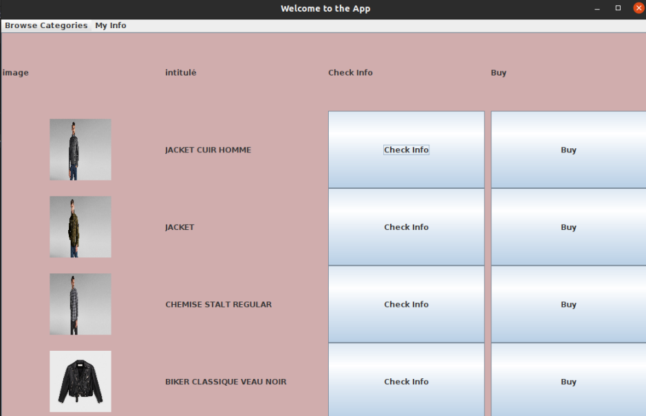

# GANGE-Database-Project

This project aims to put into practice our skills in relational database management systems.The development of the demonstrator is done in Java using the JDBC API and the graphical interface is done using the swing  java library.

## 1/ Application description :

The e-commerce company Gange wants to set up a database to better manage the products it offers for sale. The sales are based on a simple auction mode: users make increasing bids on the available products and the 5th bid wins. 
The products are categorized and an important point is the recommendation of product categories based on previous bids made by users.

## 2/ Conception Entities/Associations : 

## 3/ Demo of the application :

